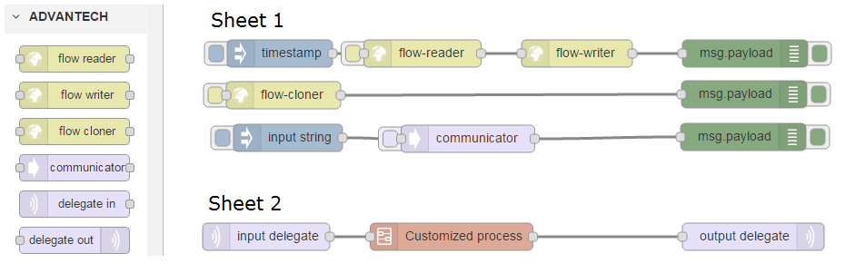

# node-red-contrib-flow-dispatcher
A collection of [Node-RED](http://nodered.org) nodes to read and write Node-RED flows.

## Install
Use npm command to install this package locally in the Node-RED modules directory
```bash
npm install node-red-contrib-flow-dispatcher
```
or globally install with the command
```bash
npm install -g node-red-contrib-flow-dispatcher
```

## Nodes included in the package
**flow reader** Read Node-RED flows from user specified URL.

**flow writer** Write Node-RED flows to user specified URL.

**flow cloner** Read Node-RED flows from localhost and write to user specified URL.

**flow communicator** Dispatch user specified sheet to destination NodeRed server and listen for return data from dispatched flows.

**delegate input** Will be replaced by a configured ready websocket-in node while flow is dispatched by flow communicator node.

**delegate output** Will be replaced by a configured ready websocket-out node while flow is dispatched by flow communicator node.


## Usage example

Click the button on the inject node, flow-reader node or flow-cloner node to trigger the dispatching process.
Click the button on communicator node will dispatch user specified sheet to destination host and replace delegate input/output nodes with configured ready websocket in/out nodes.
Click button on the inject node connected with communicator node will inject a string value to communicator node and the value will be passed to the remote dispatched flow by the communicator node.
If "Inject once at start/deploy?" is checked in flow-reader or flow-cloner node, the flow will start to execute once it is successfully deployed or Node-Red server starts.
```json
[
    {
        "id":"e8db8278.17248",
        "type":"subflow",
        "name":"Customized process",
        "in":[
            {
                "x":70,
                "y":70,
                "wires":[{"id":"b92b5d90.46d4a"}]}
        ],
        "out":[
            {
                "x":350,
                "y":70,
                "wires":[{"id":"b92b5d90.46d4a","port":0}]
            }
        ]
    },
    {
        "id":"b92b5d90.46d4a",
        "type":"function",
        "name":"FOO",
        "func":"msg.payload = \"return from FOO\";\nreturn msg;",
        "outputs":1,
        "noerr":0,
        "x":206,
        "y":71,
        "z":"e8db8278.17248",
        "wires":[[]]
    },
    {
        "id":"ce7cd611.318328",
        "type":"debug",
        "name":"",
        "active":true,
        "console":"false",
        "complete":"false",
        "x":673,
        "y":408,
        "z":"fd1a3f18.02e5c",
        "wires":[]
    },
    {
        "id":"3178cf7.fce873",
        "type":"comm",
        "name":"",
        "sheet":"Sheet 2",
        "lcl_url":"192.168.0.2:1880",
        "dest_url":"192.168.0.1:1880",
        "auth":false,
        "x":370,
        "y":410,
        "z":"fd1a3f18.02e5c",
        "wires":[["ce7cd611.318328"]]
    },
    {
        "id":"bf9f1d0f.4060e",
        "type":"inject",
        "name":"",
        "topic":"",
        "payload":"input string",
        "payloadType":"string",
        "repeat":"",
        "crontab":"",
        "once":false,
        "x":172,
        "y":409,
        "z":"fd1a3f18.02e5c",
        "wires":[["3178cf7.fce873"]]
    },
    {
        "id":"fc0f4ef8.03f0b",
        "type":"debug",
        "name":"",
        "active":true,
        "console":"false",
        "complete":"payload",
        "x":677,
        "y":263,
        "z":"fd1a3f18.02e5c",
        "wires":[]
    },
    {
        "id":"95ef543a.6a10a8",
        "type":"flow-cloner",
        "name":"",
        "url":"192.168.0.1:1880",
        "auth":false,
        "sheet":"Sheet 1",
        "once":false,
        "x":169,
        "y":337,
        "z":"fd1a3f18.02e5c",
        "wires":[["8e637cb1.719c8"]]
    },
    {
        "id":"c0a5856.f3f5a78",
        "type":"inject",
        "name":"",
        "topic":"",
        "payload":"",
        "payloadType":"date",
        "repeat":"",
        "crontab":"",
        "once":false,
        "x":165,
        "y":263,
        "z":"fd1a3f18.02e5c",
        "wires":[["118ccac9.ee7335"]]
    },
    {
        "id":"118ccac9.ee7335",
        "type":"flow-reader",
        "name":"",
        "protocol":"http",
        "url":"127.0.0.1:1880",
        "sheet":"Sheet 2",
        "auth":false,
        "once":false,
        "x":332,
        "y":263,
        "z":"fd1a3f18.02e5c",
        "wires":[["d5786e45.2a879"]]
    },
    {
        "id":"d5786e45.2a879",
        "type":"flow-writer",
        "name":"",
        "protocol":"http",
        "url":"192.168.0.1:1880",
        "auth":false,
        "x":492,
        "y":263,
        "z":"fd1a3f18.02e5c",
        "wires":[["fc0f4ef8.03f0b"]]
    },
    {
        "id":"8e637cb1.719c8",
        "type":"debug",
        "name":"",
        "active":true,
        "console":"false",
        "complete":"false",
        "x":676,
        "y":336,
        "z":"fd1a3f18.02e5c",
        "wires":[]
    },
    {
        "id":"7b44f2cd.84bb0c",
        "type":"flow-dlg-in",
        "name":"",
        "x":154,
        "y":483,
        "z":"fd1a3f18.02e5c",
        "wires":[["2efaf19b.d1050e"]]
    },
    {
        "id":"b6642c6b.499bd",
        "type":"flow-dlg-out",
        "name":"",
        "x":690,
        "y":483,
        "z":"fd1a3f18.02e5c",
        "wires":[]
    },
    {
        "id":"2efaf19b.d1050e",
        "type":"subflow:e8db8278.17248",
        "x":358,
        "y":483,
        "z":"fd1a3f18.02e5c",
        "wires":[["b6642c6b.499bd"]]
    }
]
```

## History
- 0.0.1 - October 2015 : Initial Release.
- 0.0.2 - November 2015 : Add flow-communicator, delegate-input and delegate-output nodes.

## Authors
* Neo Lo (https://github.com/neo7206)

## License
Copyright 2014, 2015 ADVANTECH Corp. under [the Apache 2.0 license](LICENSE).
